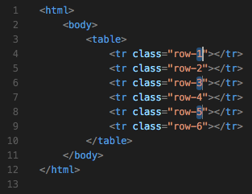
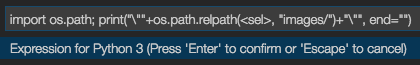

## Express-Lines
[](https://marketplace.visualstudio.com/items?itemName=spywhere.express-lines)
[](https://marketplace.visualstudio.com/items?itemName=spywhere.express-lines)

Perform code evaluation on selections

### What is Express-Lines?
Express-Lines is a utility that will run expression (in various languages) from your selections and replace the output from the evaluated expression.

### What can be use with Express-Lines?
- Run a number sequence
- Text padding
- Advanced text replacement
- and more... (examples below)

### How it works?
Simply install the extension, restart and you are good to go!

Select some selections,

- For default evaluation (in JavaScript), press `Ctrl+Alt+E` (Windows/Linux) or `Ctrl+Cmd+E` (macOS)
- For custom evaluation (using custom evaluator), press `Ctrl+Alt+C` (Windows/Linux) or `Ctrl+Cmd+C` (macOS)

then enter some expression or just press `Enter/Return`, your selections should be evaluated and replaced right away!

### Expression Syntax
An expression is simply a text that will pass to the `eval` function (in JavaScript) or as a one-liner code (for custom evaluator).
This expression system is really powerful as it can manipulate the text before passing on to the evaluator.

Each expression will be run for each selection and will be evaluated separately.

These are the macros that will provide the information about the selections and also for the manipulation...

- `\<`  
Returns a `<` character (aka. to escaped a `<` character)
- `<index>`  
Returns a selection index number
- `<lineno>`  
Returns an active line number (a line that cursor is on)
- `<line>`  
Returns a whole text on an active line
- `<sel>` or `<selection>`  
Returns a selection text (can be multi-line)
- `<len:<sub-expression>>` or `<length:<sub-expression>>`  
Returns a length of a sub-expression output
- `<lower:<sub-expression>>`  
Returns a lower-cased output from a sub-expression
- `<upper:<sub-expression>>`  
Returns an upper-cased output from a sub-expression
- `<trim:<sub-expression>>`  
Returns a whitespace-trimmed output from a sub-expression
- `<trims:<sub-expression>>`  
Returns a joined, whitespace-trimmed output from each line of a sub-expression
- `<join:<value>:<sub-expression>>`  
Returns a joined output from each line of a sub-expression using `value` as a separator
- `<escaped:<sub-expression>>`  
Returns an escaped output from a sub-expression using `escapeCharacters` on the evaluator

#### Examples

Text:
```
    Alex is riding a bear to the village
while Bob is playing a kite. Meanwhile,
Carl is preparing food for them.
```

Selections:
- `Alex` on line 1
- `Bob` on line 2
- `Carl` on line 3

Expression: `<sel>`  
Output:
- `Alex` from 1st selection
- `Bob` from 2nd selection
- `Carl` from 3rd selection

Expression: `<line>`  
Output:
- `    Alex is riding a bear to the village` from 1st selection
- `while Bob is playing a kite. Meanwhile,` from 2nd selection
- `Carl is preparing food for them.` from 3rd selection

Expression: `<upper:<sel>>[<lineno>]`  
Output:
- `ALEX[1]` from 1st selection
- `BOB[2]` from 2nd selection
- `CARL[3]` from 3rd selection

Expression: `<escaped:"<len:<sel>>">`  
Output:
- `\"4\"` from 1st selection
- `\"3\"` from 2nd selection
- `\"4\"` from 3rd selection

Expression: `Line <lineno> contains <length:<trim:<line>>> characters`  
Output:
- `Line 1 contains 36 characters` from 1st selection
- `Line 2 contains 39 characters` from 2nd selection
- `Line 3 contains 32 characters` from 3rd selection

### Example Usages

#### Run a number sequence
- Let's say we want to add each table row and new class named `row-1`, `row-2` and `row-3` accordingly  


- First we prepare for the naming part  


- Then we run a default evaluator (in this example, JavaScript) with the following expression `<index>+1`  


- Here is our class name after evaluated the expression  


- How about add more rows?  


- Now we want to name it evenly so we use `(<index>+1)*2`  


- Nice! What about the odd one? Seems strange...  


- Say no more! Just select it again  


- Then we will use them as our input for the expression `<sel>*2-1`  


- Now it's done!  


#### Text padding
- Here we want to pad our variable names to align to the right  


- First, we select it  


- This time we will use Python 3 to help us for the alignment  


- Since the longest word is 14 characters long, we will use `print("%14s" % ("<sel>"), end="")`  


- Done!  


#### Advanced text replacement

- Let's say we want to change all of these image paths to be relative to the `images/` path  


- As always, select it first  


- We will use Python 3 again  


- Now we utilise `os.path` for the path manipulation with `import os.path; print("\""+os.path.relpath(<sel>, "images/")+"\"", end="")`  


- Now our image paths has been changed correcly. Yay!  


### FAQs

**Q:** License?  
**A:** MIT
